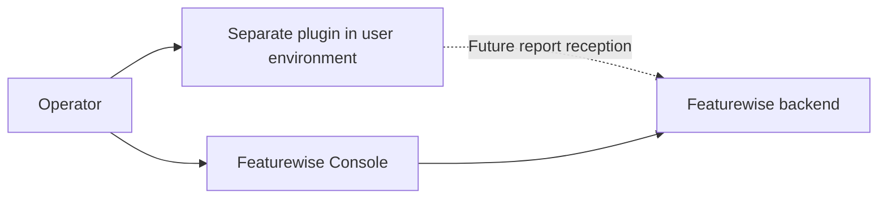

# System context

```mermaid
flowchart LR
  User[Operator] --> Console[Featurewise Console]
  User --> Plugin[Separate plugin in user environment]
  Plugin -. Future report reception .-> API[Featurewise backend]
  Console --> API
```

The plugin is developed separately. The dotted connection is deferred; the
Console currently manages containers and reports history as unavailable.
