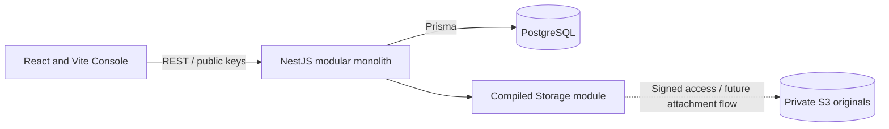

# Local-first containers

Auth, Workspace, Features, Database, Storage and Health remain active modules.
Login and container management require no S3 configuration. SQL migrations and
the deterministic harness never call S3. Report tables do not expose HTTP APIs.
