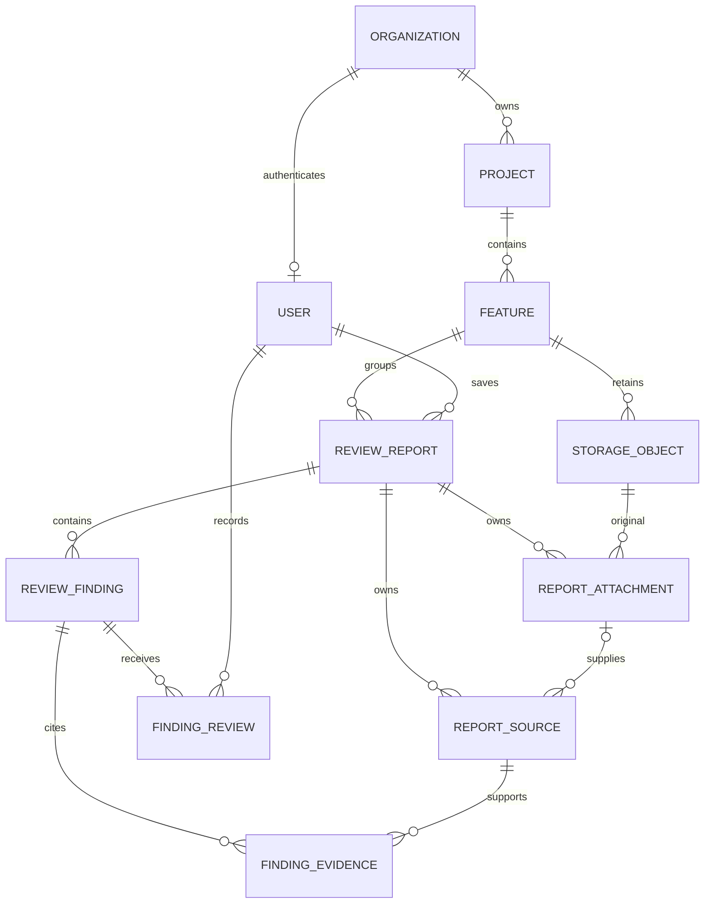

# Report domain

Report content, format version, producer date, saving author and saving date are
immutable. Findings, report sources, evidence and attachments reject mutation.
Decisions are append-only; order by createdAt and publicNumber for disposition.
Composite foreign keys constrain evidence and attachment sources to their report,
and attached originals to the report feature. MCP sources retain references only.
No relation automatically associates findings from different reports.
